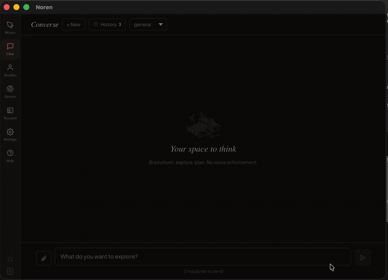

<p align="center">
  <strong>暖簾</strong>
</p>

<h1 align="center">Noren</h1>

<p align="center">
  AI writing that sounds like you.<br>
  A macOS desktop app that learns your voice and weaves it into everything you write.
</p>

<p align="center">
  <a href="https://usenoren.ai">Website</a> · <a href="https://usenoren.ai">Download</a>
</p>

<p align="center">
  
</p>

---

## What is Noren?

Noren extracts your unique writing voice from samples you provide, then uses that voice profile to generate text that sounds like you, not like a chatbot.

**Weave** - Write a prompt, get voice-matched output. Paste or inject directly into any app.

**Chat** - Conversational mode with full history and file attachments. Every response is filtered through your voice.

**Extract** - Feed in writing samples (emails, docs, tweets). Noren distills your tone, rhythm, sentence structure, and vocabulary into a portable voice profile.

**Compare** - See your voiced output side-by-side with generic AI output. The difference is the product.

## Who uses it

- **Fiction writers** use Noren to preserve narrator, character, and genre voice while drafting or revising with AI. See: [AI fiction writing: why every character sounds like ChatGPT](https://usenoren.ai/blog/ai-fiction-writing-character-voice)
- **Newsletter writers** use Noren to keep AI drafts from turning into generic content-marketing prose. See: [How to use AI for your newsletter without losing your voice](https://usenoren.ai/blog/ai-newsletter-writing)
- **Founders and operators** use Noren for emails, updates, posts, and agent-written communication that should still sound like the person behind it.

## How it works

```
Your writing samples → Voice extraction → Profile (core identity + format contexts)
                                              ↓
Your prompt + profile → LLM → Voice-matched output → Clipboard / Inject into app
```

The voice profile is a structured document that captures *how* you write, not what you write about. It travels with you across formats - emails, tweets, docs, Slack messages, adapting enforcement level (strict / guided / light) per use case.

You can inspect what that artifact looks like:

- [Raw Markdown sample, using public-safe demo data](examples/sample-voice-profile.md)
- [Interactive sample profiles from named public writers](https://usenoren.ai/sample-voice-profile)

## Architecture

```
noren-app/
├── src-tauri/              Rust backend (Tauri v2)
│   ├── src/
│   │   ├── main.rs         App lifecycle, command registration
│   │   ├── commands/       Tauri IPC commands
│   │   │   ├── generate.rs   Weave generation (voice-aware)
│   │   │   ├── chat.rs       Chat + conversation persistence
│   │   │   ├── extract.rs    Voice extraction orchestration
│   │   │   ├── profiles.rs   Profile CRUD + server sync
│   │   │   ├── settings.rs   Config, provider, hotkey management
│   │   │   ├── billing.rs    Subscription / checkout
│   │   │   └── living_profile.rs  Edit logging + profile evolution
│   │   ├── window.rs       Popup + main window management
│   │   ├── hotkey.rs       Global shortcut (Cmd+K default)
│   │   ├── accessibility.rs  macOS AX API (text capture, injection)
│   │   ├── clipboard.rs    Clipboard read/write
│   │   ├── keychain.rs     macOS Keychain for API keys
│   │   └── tray.rs         Menu bar tray icon
│   └── noren-engine/       Core library (extraction, generation, LLM clients)
│
├── src-frontend/           Svelte 5 + Tailwind v4 frontend
│   └── src/
│       ├── app.css         Design system (Japanese indigo palette, dark mode)
│       └── lib/
│           ├── components/
│           │   ├── Shell.svelte        Popup window shell
│           │   ├── MainShell.svelte    Main app window with sidebar
│           │   ├── GenerateView.svelte Weave interface
│           │   ├── ChatView.svelte     Chat with history + attachments
│           │   ├── ProfilesView.svelte Voice profile viewer/editor
│           │   ├── ExtractView.svelte  Voice extraction flow
│           │   ├── SettingsView.svelte Provider config, billing, hotkey
│           │   └── OnboardingView.svelte  First-run setup
│           ├── api/tauri.ts   Type-safe Tauri command bindings
│           └── stores/        Svelte 5 reactive state (subscription)
```

## Stack

| Layer | Technology |
|-------|-----------|
| Framework | [Tauri v2](https://v2.tauri.app) |
| Backend | Rust |
| Frontend | Svelte 5, Tailwind CSS v4 |
| LLM | Anthropic, OpenAI, Gemini, Ollama, or any OpenAI-compatible provider |
| Storage | `~/.noren/` (profiles, config, chat history) |
| Secrets | macOS Keychain |
| Platform | macOS 13+ (Apple Silicon + Intel) |

## Design

The visual identity draws from Japanese indigo dyeing - the same craft tradition as the noren curtain.

- **KON** (紺) `#1E3148` - deep indigo, primary
- **HANADA** (縹) `#3B6B8A` - mid indigo, secondary
- **AIJIRO** (藍白) `#E8EDF2` - palest indigo, tints
- **SHU** (朱) `#C44A2F` - persimmon red, accent
- **KINU** (絹) `#F6F1EB` - unbleached silk, background
- **SUMI** (墨) `#2B2725` - ink stone, text

Dark mode automatically matches macOS appearance via `prefers-color-scheme`.

Fonts: [Fraunces](https://fonts.google.com/specimen/Fraunces) (headings), [Plus Jakarta Sans](https://fonts.google.com/specimen/Plus+Jakarta+Sans) (body), [JetBrains Mono](https://fonts.google.com/specimen/JetBrains+Mono) (code).

## Development

### Prerequisites

- [Rust](https://rustup.rs/) (latest stable)
- [Node.js](https://nodejs.org/) 18+ or [Bun](https://bun.sh/)
- [Tauri CLI](https://v2.tauri.app/start/prerequisites/) - `cargo install tauri-cli`
- Xcode Command Line Tools - `xcode-select --install`

### Run

```bash
# Install frontend dependencies
cd src-frontend && npm install && cd ..

# Development (hot reload)
cargo tauri dev

# Production build
cargo tauri build
```

The dev build creates a popup window (triggered by global hotkey) and a main app window. The production build outputs `Noren.app`; public user downloads are signed, notarized `.pkg` installers built from that app bundle.

### Release notes for macOS builds

The app bundles a Chrome native-messaging sidecar for Keychain access. Release builds need both of these files present:

- `src-tauri/binaries/noren-keychain-host-aarch64-apple-darwin`
- `src-tauri/binaries/noren-keychain-host-x86_64-apple-darwin`

They are now tracked in git and must stay in sync with `src/bin/noren-keychain-host.rs`.

If you need to rebuild the sidecars locally:

```bash
# Apple Silicon sidecar
cargo build --manifest-path src-tauri/Cargo.toml --bin noren-keychain-host --target aarch64-apple-darwin --release
cp src-tauri/target/aarch64-apple-darwin/release/noren-keychain-host src-tauri/binaries/noren-keychain-host-aarch64-apple-darwin

# Intel sidecar
rustup target add x86_64-apple-darwin
cargo build --manifest-path src-tauri/Cargo.toml --bin noren-keychain-host --target x86_64-apple-darwin --release
cp src-tauri/target/x86_64-apple-darwin/release/noren-keychain-host src-tauri/binaries/noren-keychain-host-x86_64-apple-darwin
```

Release build flow:

```bash
# ARM app
cargo tauri build

# Intel app
cargo tauri build --target x86_64-apple-darwin
```

For local signed + notarized builds, the machine must have:

- a `Developer ID Application` certificate imported into Keychain
- Apple notarization credentials available either as:
  - `APPLE_ID`, `APPLE_PASSWORD`, and `APPLE_TEAM_ID`
  - or a saved `notarytool` Keychain profile
- the Tauri updater signing key available via:
  - `TAURI_SIGNING_PRIVATE_KEY`
  - `TAURI_SIGNING_PRIVATE_KEY_PASSWORD`

Build public installer packages from the signed `.app` bundles:

```bash
mkdir -p /tmp/noren-release-X.Y.Z
mkdir -p /tmp/noren-pkg-root-X.Y.Z/{aarch64,x64}
ditto src-tauri/target/release/bundle/macos/Noren.app \
  /tmp/noren-pkg-root-X.Y.Z/aarch64/Noren.app
ditto src-tauri/target/x86_64-apple-darwin/release/bundle/macos/Noren.app \
  /tmp/noren-pkg-root-X.Y.Z/x64/Noren.app
pkgbuild --analyze --root /tmp/noren-pkg-root-X.Y.Z/aarch64 \
  /tmp/noren-release-X.Y.Z/components-aarch64.plist
pkgbuild --analyze --root /tmp/noren-pkg-root-X.Y.Z/x64 \
  /tmp/noren-release-X.Y.Z/components-x64.plist
plutil -replace 0.BundleIsRelocatable -bool NO /tmp/noren-release-X.Y.Z/components-aarch64.plist
plutil -replace 0.BundleIsRelocatable -bool NO /tmp/noren-release-X.Y.Z/components-x64.plist
pkgbuild --root /tmp/noren-pkg-root-X.Y.Z/aarch64 \
  --install-location /Applications \
  --identifier ink.noren.desktop \
  --version X.Y.Z \
  --component-plist /tmp/noren-release-X.Y.Z/components-aarch64.plist \
  --sign "Developer ID Installer: Okajevo Onome (YZ64BWQC3R)" \
  /tmp/noren-release-X.Y.Z/Noren_X.Y.Z_aarch64.pkg
pkgbuild --root /tmp/noren-pkg-root-X.Y.Z/x64 \
  --install-location /Applications \
  --identifier ink.noren.desktop \
  --version X.Y.Z \
  --component-plist /tmp/noren-release-X.Y.Z/components-x64.plist \
  --sign "Developer ID Installer: Okajevo Onome (YZ64BWQC3R)" \
  /tmp/noren-release-X.Y.Z/Noren_X.Y.Z_x64.pkg
```

Keep `BundleIsRelocatable` set to `false`; otherwise macOS Installer can update an old copy outside `/Applications`.

Current public GitHub release assets expected by the website are:

- `Noren_X.Y.Z_aarch64.pkg`
- `Noren_X.Y.Z_x64.pkg`

After building, notarize and staple the packages, then upload them to the matching GitHub release with `gh release upload ... --clobber`.

### Install

Current release builds are intended to be:

- Developer ID signed
- notarized by Apple
- stapled before distribution

Users should be able to download the `.pkg`, run the standard macOS Installer, and open `Noren.app` from `/Applications` without unsigned-app warnings.

### Inference modes

**BYOK (Bring Your Own Key)** - Use your own API key with any supported provider. Keys are stored in macOS Keychain, never in config files.

**Noren Pro** - Managed inference through `api.usenoren.ai`. No API key needed. Includes server-side voice extraction and profile sync.

## License

[MIT](LICENSE)
